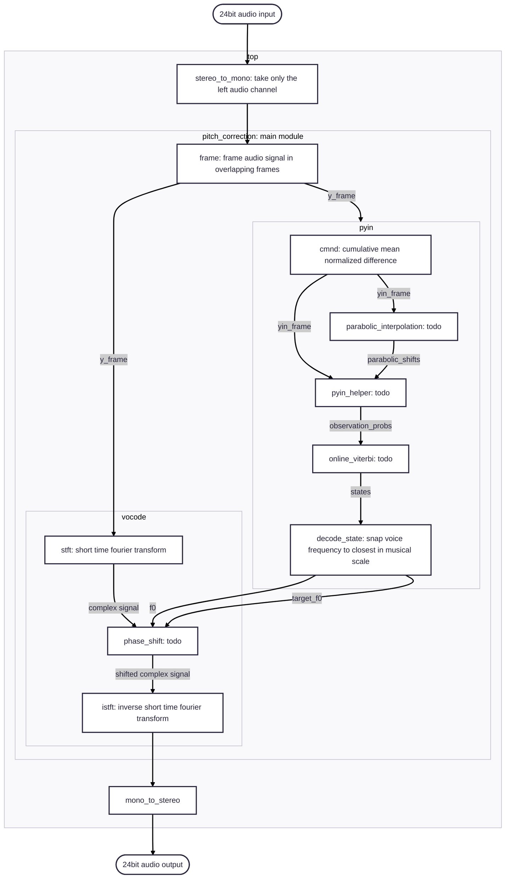

```mermaid
---
config:
      theme: redux
---
flowchart TD
  input(["24bit audio input"])
  output(["24bit audio output"])

  subgraph pyin
    cmnd["cmnd: cumulative mean normalized difference"]
    parabolic_interpolation["parabolic_interpolation: todo"]
    pyin_helper["pyin_helper: todo"]
    online_viterbi["online_viterbi: todo"]


    cmnd -- yin_frame --> parabolic_interpolation
    cmnd -- yin_frame --> pyin_helper

    parabolic_interpolation -- parabolic_shifts --> pyin_helper

    pyin_helper -- observation_probs --> online_viterbi

    online_viterbi -- states --> decode_state
  end

  subgraph vocode
    stft["stft: short time fourier transform"]
    phase_shift["phase_shift: todo"]
    istft["istft: inverse short time fourier transform"]

    stft -- complex signal --> phase_shift
    phase_shift -- shifted complex signal --> istft
  end

  subgraph pitch_correction["pitch_correction: main module"]
    frame["frame: frame audio signal in overlapping frames"]
    pyin["pyin: pitch detection"]
    decode_state["decode_state: snap voice frequency to closest in musical scale"]
    vocode


    frame -- y_frame --> pyin
    frame -- y_frame --> stft
    decode_state -- f0 --> phase_shift
    decode_state -- target_f0 --> phase_shift
  end

  subgraph top
    stereo_to_mono["stereo_to_mono: take only the left audio channel"]
    pitch_correction
    mono_to_stereo["mono_to_stereo"]

    stereo_to_mono --> frame

  end

  input --> stereo_to_mono
  istft --> mono_to_stereo
  mono_to_stereo --> output

```
